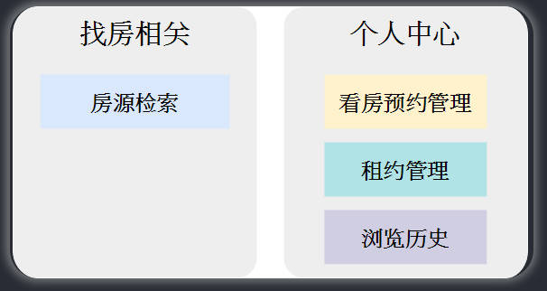
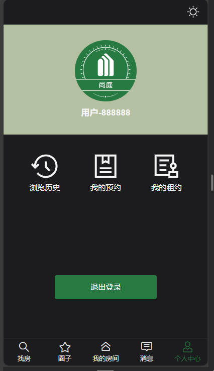

---
    學習資源:B站尚硅谷
---
# JAVA 尚廷公寓-項目介紹及資料庫設計

## 學習目的

此次為第二次學習此項目，第一次學習時並沒有太了解項目的業務邏輯，以及資料表的結構，使得在實作 api 時，儘管只是簡單的 CRUD，但有些部分會因為對資料表的不熟悉，而聽得不是很明白，所以此次會詳細理解資料表的結構是如何設計的。

### 主要學習點

1. 了解一般前後端項目開發流程
2. 了解資料庫的具體設計步驟
3. 複習 MyBatis-Plus 使用方式
4. 了解 redis 的具體應用場景
5. 了解 nginx 的部屬流程

## 項目概述

此項目為一個公寓租賃平台，又分為移動端(app)、後台管理端。

### 移動端

尚硅谷提供的移動端項目URL:`http://139.198.127.41:8002`

移動端就是一般用戶使用的介面，這裡設計成 mobile 的介面。

#### 主要業務功能

##### 房源檢索

根據搜尋條件去查詢房間

##### 租約管理、瀏覽歷史

就是對應圖中的幾個功能。

而預約看房的功能，是放在房間頁面的，當點進去某間房間時，就會出現預約看房的按鈕。

### 後臺管理

#### 主要業務功能

尚硅谷提供的後台URL:`http://139.198.127.41:8001`

這裡功能比較多，但都不複雜，直接操作也能理解，比較需要注意的是屬性滿多的，要理解每個屬性的業務邏輯，以及「租賃管理」是少數真正涉及到使用者的功能。

**另外，這個項目的用戶似乎沒有房東、房客等身分別，租約是直接由後臺管理員建立給租客(用戶)的，而不是透過房東建立給租客這種形式。**

- 公寓資訊管理

 這個模組負責管理所有公寓的基本訊息，包括公寓名稱、地址、聯絡資訊等。管理員可以在這裡新增、編輯、刪除公寓資訊。

- 房間資訊管理

 本模組負責管理每個公寓內各個房間的詳細信息，包括房間號碼、戶型、面積、租金等。管理員可以在這裡進行房間資訊的新增、編輯和刪除。

- 公寓/房間屬性管理

 這個模組允許管理員定義公寓和房間的各種屬性，例如公寓和房間的配套設施，方便管理員在維護公寓資訊和房間資訊時進行選擇。

- 看房預約管理

 此模組用於管理使用者的看房預約請求。使用者可以在行動端提交看房預約，管理員可以在後台管理系統中查看和處理這些請求，以方便安排人員接待使用者。

- 租約管理

 這個模組用於管理租約的建立、修改和終止。管理員可以在這裡產生租約合同，並發送給用戶簽約。

- 後台系統使用者管理

 此模組用於管理後台系統的使用者帳戶訊息，管理員可以建立、編輯、刪除、停用帳戶資訊。

- 行動端用戶管理

 這個模組負責管理行動端用戶的資訊。管理員可以查看使用者訊息，處理帳戶相關問題。

### 核心業務邏輯流程

可以看到租約是由後臺管理員直接建立的，而非由房東對房客。

## 項目開發流程

這裡介紹的是分工後的前後端分離開發流程，若是對於 side project 這種一人包辦的項目，目前是認為以下流程或許較順暢，下次會以此做看看。

step. 1: 創建初步產品原型。

step. 2: 根據原型使用 Figma 等工具設計 UI 介面。

step. 3: 根據產品原型及 UI 介面設計初步的資料表(概念、邏輯、物理模型)。

step. 4: 先把前端實現出來，並看看有沒有要修改的功能，然後微調資料庫結構。

step. 5: 實作後端 API。

## 資料庫設計

不具體介紹 E-R Model 那些概念。另外教學並沒有介紹正規化那些，但有使用到概念。

### 資料庫設計理論

通常傳統的資料庫設計會分為以下三個階段。

#### 概念模型設計

這階段只注重實體(Entity)與關係(Relationship)，並不探討更詳細的訊息，例如實體的屬性等等。

譬如對於一個選課系統而言，可以分析會涉及到的實體大概就是課程、老師、學生，而學生又會有所屬的班級。

#### 邏輯模型設計

此階段相比於概念模型，主要是包含了實體的具體細節(屬性等等)，以及關聯兩個實體的字段，或是中間表等等，但不會關注到具體的底層資料庫架構(譬如是使用MySQL還是Oracle)。

#### 物理模型設計

此階段相比於邏輯模型，主要是包含了具體的資料庫實現細節，譬如使用 MySQL 還是 Oracle，字段的類型，INDEX 等等。

### 項目資料庫設計實戰

所有 Table 都有 `create_time、update_time、is_deleted`，但這裡省略。

#### 概念模型設計

要做的第一件事是找實體有哪些，而教學中是根據前端頁面去找出實體的，個人認為這也是最直觀的方式，因此若要自己實現全端的話，還是先做出網站介面明確功能應該比較好。

##### 此項目的概念模型

先找出有哪些實體後，再去思考這些實體之間的關係。

**另外，房間與租約的關係為一對多，這是因為一個房間可能會有歷史租約，並非指的是一個房間同時租給多個用戶。**

#### 此項目的邏輯模型

這邊發生的問題及解決方式，看起來都是透過正規化即可解決的，教學中應該是直接省略了 1NF、2NF 等等的教學，直接說明結論。

##### 公寓信息

像是標籤這屬性是在邏輯模型階段，透過明確公寓的屬性時，才從屬性延伸成一個實體(Entity)的，個人認為對於這種屬性延伸成實體的情況，應該是無法在概念模型階段就發現，還是得等到邏輯模型確認屬性後透過正規化等方式才能發現。

- 圖片信息 Table: 項目中設計成此 Table 儲存者房間與公寓的圖片，因此需要一個字段「圖片所屬對象類型」來區分是房間還是公寓。

- 配套信息 Table: 與圖片 Table 同理，也需要一個字段來區分公寓房間。

- 標籤信息 Table: 同上。

找出公寓有哪些字段，也是根據原型，教學中是直接拿前端畫面，但目前我的認知所謂原型應該也是來自於 Figma 的設計頁面，應該不會是更抽象的描述。

另外關於房間價格的部分，教學裡說明不把此當作一個屬性，這是因為這個價格指的是這個公寓裡最低的房間價格，若假設這個公寓裡的房間價格有所變動，那這個屬性也要變動一次，比較麻煩，因此這裡採的方法是 call api 時再計算這個房間價格。

###### 雜費信息 Table

首先，一個公寓會有多個雜費項，而一個雜費項也可能對應到多個公寓，因此是多對多的關係，但一個雜費項名稱也會有多個雜費項值，而一個雜費項值也會對應到雜費項名稱，因此才會拆成這種結構。

下圖可看到，網費對應到多個雜費值，而也可能有一個雜費值對應到多個雜費名稱的情況。

但這種設計方式要關聯的表較多，影響效能，因此也不全然是所有場景都採用此種分表。

##### 房間信息

似乎沒什麼好補充的。

##### 用戶信息

略。

##### 看房預約信息

略。

##### 租約信息

略。

##### 瀏覽歷史信息

略。

##### 後臺管理系統

略。

#### 物理模型設計

因為已經不具備任何邏輯上的概念，只是再具體決字段名、資料類型而已，故不紀錄。

## API 設計

略。
