# 1. 後台管理系統項目初始化

## 1. 資料庫初始化

- 1. 創建資料庫

        `CREATE DATABASE lease CHARACTER SET utf8mb4 COLLATE utf8mb4_general_ci;`
- 2. 導入資料庫腳本

        將`lease.sql`導入`lease`資料庫。

## 2. 項目結構初始化

此項目的 Spring-Boot 項目結構如下:

```txt
lease
├── common（公共 module ——工具類、公用配置等）
│   ├── pom.xml
│   └── src
├── model（數據 module —— 與資料庫對應的 Entity）
│   ├── pom.xml
│   └── src
├── web（Web module）
│   ├── pom.xml
│   ├── web-admin（後台管理系統 Web module —— Controller、Service、Mapper 等）
│   │   ├── pom.xml
│   │   └── src
│   └── web-app（移動端 Web module —— Controller、Service、Mapper 等）
│       ├── pom.xml
│       └── src
└── pom.xml
```

可以看到把 common、model、web 都拆開來成一個 module，並且透過在 web module 以 maven dependency 的方式去導入 common、model，目前理解這樣做的好處有以下幾點。

- 每個 module 職責分明。
- 重用性，像 common、model 等 module 被抽離成一個 module 時，即可被多個 web module 給重複利用。
- 便於部屬及維護，當抽離成各個不同的 module 時，各個 module 都可以單獨構建及發布，並且若只需更新 web module，那就只需要重新佈署 web module，而不必再重新構建及部屬 common、model。

web module maven dependency:

```xml
<?xml version="1.0" encoding="UTF-8"?>
<project xmlns="http://maven.apache.org/POM/4.0.0"
         xmlns:xsi="http://www.w3.org/2001/XMLSchema-instance"
         xsi:schemaLocation="http://maven.apache.org/POM/4.0.0 http://maven.apache.org/xsd/maven-4.0.0.xsd">
    <modelVersion>4.0.0</modelVersion>
    <parent>
        <groupId>com.atguigu</groupId>
        <artifactId>lease-two</artifactId>
        <version>1.0-SNAPSHOT</version>
    </parent>

    <artifactId>web</artifactId>
    <packaging>pom</packaging>
    <modules>
        <module>web-admin</module>
        <module>web-app</module>
    </modules>

    <properties>
        <maven.compiler.source>17</maven.compiler.source>
        <maven.compiler.target>17</maven.compiler.target>
        <project.build.sourceEncoding>UTF-8</project.build.sourceEncoding>
    </properties>

    <dependencies>
        <dependency>
            <groupId>com.atguigu</groupId>
            <artifactId>model</artifactId>
            <version>1.0-SNAPSHOT</version>
        </dependency>
        <dependency>
            <groupId>com.atguigu</groupId>
            <artifactId>common</artifactId>
            <version>1.0-SNAPSHOT</version>
        </dependency>
    </dependencies>

</project>
```

## 3. 後臺管理系統項目初始化配置

當 1~5 都配置完後，即可啟動項目並訪問 Knife4j API 文件，URL為`http://localhost:8080/doc.html`。

### 1. Spring-Boot 配置

#### lease-two module pom.xml

在 root(lease-two) 配置以下 `pom.xml` 檔，root 主要是用來做依賴版本控制的，並不真的導入依賴。

```xml
<?xml version="1.0" encoding="UTF-8"?>
<project xmlns="http://maven.apache.org/POM/4.0.0"
         xmlns:xsi="http://www.w3.org/2001/XMLSchema-instance"
         xsi:schemaLocation="http://maven.apache.org/POM/4.0.0 http://maven.apache.org/xsd/maven-4.0.0.xsd">
    <modelVersion>4.0.0</modelVersion>

    <groupId>com.atguigu</groupId>
    <artifactId>lease-two</artifactId>
    <version>1.0-SNAPSHOT</version>
    <packaging>pom</packaging>
    <modules>
        <module>common</module>
        <module>model</module>
        <module>web</module>
    </modules>

    <!-- 繼承 Spring Boot 父項目 -->
    <parent>
        <groupId>org.springframework.boot</groupId>
        <artifactId>spring-boot-starter-parent</artifactId>
        <version>3.0.5</version>
    </parent>

    <!-- 以 variable 的方式決定依賴版本 -->
    <properties>
        <maven.compiler.source>17</maven.compiler.source>
        <maven.compiler.target>17</maven.compiler.target>
        <project.build.sourceEncoding>UTF-8</project.build.sourceEncoding>
        <mybatis-plus.version>3.5.3.1</mybatis-plus.version>
        <swagger.version>2.9.2</swagger.version>
        <jwt.version>0.11.2</jwt.version>
        <easycaptcha.version>1.6.2</easycaptcha.version>
        <minio.version>8.2.0</minio.version>
        <knife4j.version>4.1.0</knife4j.version>
        <aliyun.sms.version>2.0.23</aliyun.sms.version>
    </properties>

    <!--統一管理子模組要導入的依賴版本-->
    <dependencyManagement>
        <dependencies>
            <!--mybatis-plus-->
            <!--官方文档：https://baomidou.com/pages/bab2db/ -->
            <dependency>
                <groupId>com.baomidou</groupId>
                <artifactId>mybatis-plus-boot-starter</artifactId>
                <version>${mybatis-plus.version}</version>
            </dependency>

            <!--knife4j-->
            <!--官方文档：https://doc.xiaominfo.com/docs/quick-start -->
            <dependency>
                <groupId>com.github.xiaoymin</groupId>
                <artifactId>knife4j-openapi3-jakarta-spring-boot-starter</artifactId>
                <version>${knife4j.version}</version>
            </dependency>

            <!--JWT-->
            <!--官方文檔：https://github.com/jwtk/jjwt#install-jdk-maven -->
            <dependency>
                <groupId>io.jsonwebtoken</groupId>
                <artifactId>jjwt-api</artifactId>
                <version>${jwt.version}</version>
            </dependency>
            <dependency>
                <groupId>io.jsonwebtoken</groupId>
                <artifactId>jjwt-impl</artifactId>
                <scope>runtime</scope>
                <version>${jwt.version}</version>
            </dependency>
            <dependency>
                <groupId>io.jsonwebtoken</groupId>
                <artifactId>jjwt-jackson</artifactId>
                <scope>runtime</scope>
                <version>${jwt.version}</version>
            </dependency>

            <!--圖形驗證碼-->
            <!--官方文檔：https://gitee.com/ele-admin/EasyCaptcha -->
            <dependency>
                <groupId>com.github.whvcse</groupId>
                <artifactId>easy-captcha</artifactId>
                <version>${easycaptcha.version}</version>
            </dependency>

            <!--minio，在此項目主要用於儲存圖片-->
            <!--官方文檔：https://min.io/docs/minio/linux/developers/minio-drivers.html?ref=docs#java-sdk -->
            <dependency>
                <groupId>io.minio</groupId>
                <artifactId>minio</artifactId>
                <version>${minio.version}</version>
            </dependency>

            <!-- 這個我不需要，之後應該會用 line bot 等等替代 -->
            <!--阿里云短信客户端，用于发送短信验证码-->
            <!--官方文档：https://help.aliyun.com/document_detail/215759.html?spm=a2c4g.215759.0.0.49f32807f4Yc0y -->
<!--            <dependency>-->
<!--                <groupId>com.aliyun</groupId>-->
<!--                <artifactId>dysmsapi20170525</artifactId>-->
<!--                <version>${aliyun.sms.version}</version>-->
<!--            </dependency>-->
        </dependencies>
    </dependencyManagement>

</project>
```

#### web module pom.xml

```xml
<?xml version="1.0" encoding="UTF-8"?>
<project xmlns="http://maven.apache.org/POM/4.0.0"
         xmlns:xsi="http://www.w3.org/2001/XMLSchema-instance"
         xsi:schemaLocation="http://maven.apache.org/POM/4.0.0 http://maven.apache.org/xsd/maven-4.0.0.xsd">
    <modelVersion>4.0.0</modelVersion>
    <parent>
        <groupId>com.atguigu</groupId>
        <artifactId>lease-two</artifactId>
        <version>1.0-SNAPSHOT</version>
    </parent>

    <artifactId>web</artifactId>
    <packaging>pom</packaging>
    <modules>
        <module>web-admin</module>
        <module>web-app</module>
    </modules>

    <properties>
        <maven.compiler.source>17</maven.compiler.source>
        <maven.compiler.target>17</maven.compiler.target>
        <project.build.sourceEncoding>UTF-8</project.build.sourceEncoding>
    </properties>

    <dependencies>
        <dependency>
            <groupId>com.atguigu</groupId>
            <artifactId>model</artifactId>
            <version>1.0-SNAPSHOT</version>
        </dependency>
        <dependency>
            <groupId>com.atguigu</groupId>
            <artifactId>common</artifactId>
            <version>1.0-SNAPSHOT</version>
        </dependency>

        <dependency>
            <groupId>org.springframework.boot</groupId>
            <artifactId>spring-boot-starter-web</artifactId>
        </dependency>
        <dependency>
            <groupId>org.springframework.boot</groupId>
            <artifactId>spring-boot-starter-test</artifactId>
        </dependency>
    </dependencies>

    <!-- Spring Boot 提供的打包插件，用於打包可執行的 jar 包 -->
    <build>
        <plugins>
            <plugin>
                <groupId>org.springframework.boot</groupId>
                <artifactId>spring-boot-maven-plugin</artifactId>
            </plugin>
        </plugins>
    </build>
</project>
```

##### `spring-boot-maven-plugin` 與 `maven-compiler-plugin` 差別

`maven-compiler-plugin`所打包出來的 jar 只包含者項目本身的 .class文件 及 resource 下的資源，並不包含第三方 jar，而`spring-boot-maven-plugin`則會把第三方 jar 也一起打包成一個 jar 檔。

#### 創建`application.yml`

在 web-admin 下創建`application.yml`

```yml
server:
  port: 8080
```

#### 創建 Spring-Boot 啟動類

```java
package com.atguigu.lease;

import org.springframework.boot.SpringApplication;
import org.springframework.boot.autoconfigure.SpringBootApplication;

/**
 * ClassName: AdminWebApplication
 * Package: com.atguigu.lease
 */
@SpringBootApplication
public class AdminWebApplication {
    public static void main(String[] args) {
        SpringApplication.run(AdminWebApplication.class, args);
    }
}

```

### 2. MyBatis-Plus 配置

#### 1. 配置 common module pom.xml

```xml
<?xml version="1.0" encoding="UTF-8"?>
<project xmlns="http://maven.apache.org/POM/4.0.0"
         xmlns:xsi="http://www.w3.org/2001/XMLSchema-instance"
         xsi:schemaLocation="http://maven.apache.org/POM/4.0.0 http://maven.apache.org/xsd/maven-4.0.0.xsd">
    <modelVersion>4.0.0</modelVersion>
    <parent>
        <groupId>com.atguigu</groupId>
        <artifactId>lease-two</artifactId>
        <version>1.0-SNAPSHOT</version>
    </parent>

    <artifactId>common</artifactId>

    <properties>
        <maven.compiler.source>17</maven.compiler.source>
        <maven.compiler.target>17</maven.compiler.target>
        <project.build.sourceEncoding>UTF-8</project.build.sourceEncoding>
    </properties>

    <dependencies>
        <!--mybatis-plus-->
        <dependency>
            <groupId>com.baomidou</groupId>
            <artifactId>mybatis-plus-boot-starter</artifactId>
        </dependency>

        <!--mysql driver-->
        <dependency>
            <groupId>com.mysql</groupId>
            <artifactId>mysql-connector-j</artifactId>
        </dependency>
    </dependencies>
</project>
```

#### 2. 配置 model module pom.xml

```xml
<?xml version="1.0" encoding="UTF-8"?>
<project xmlns="http://maven.apache.org/POM/4.0.0"
         xmlns:xsi="http://www.w3.org/2001/XMLSchema-instance"
         xsi:schemaLocation="http://maven.apache.org/POM/4.0.0 http://maven.apache.org/xsd/maven-4.0.0.xsd">
    <modelVersion>4.0.0</modelVersion>
    <parent>
        <groupId>com.atguigu</groupId>
        <artifactId>lease-two</artifactId>
        <version>1.0-SNAPSHOT</version>
    </parent>

    <artifactId>model</artifactId>

    <properties>
        <maven.compiler.source>17</maven.compiler.source>
        <maven.compiler.target>17</maven.compiler.target>
        <project.build.sourceEncoding>UTF-8</project.build.sourceEncoding>
    </properties>

    <dependencies>
        <!--mybatis-plus-->
        <dependency>
            <groupId>com.baomidou</groupId>
            <artifactId>mybatis-plus-boot-starter</artifactId>
        </dependency>
    </dependencies>

</project>
```

#### 3. 配置 web-admin module `application.yml`

```yml
server:
  port: 8080

spring:
  datasource:
    type: com.zaxxer.hikari.HikariDataSource
    url: jdbc:mysql://192.168.246.100:3306/lease?useUnicode=true&characterEncoding=utf-8&useSSL=false&allowPublicKeyRetrieval=true&serverTimezone=GMT%2b8
    username: root
    password: Atguigu.123
    hikari:
      # 會根據所配置的查詢語句去檢查連接是否正常，譬如這裡連接時會去執行 SELECT 1，若查詢成功，
      # 代表這次連接沒有問題
      connection-test-query: SELECT 1
      connection-timeout: 60000 #資料庫連接超時時間，默認 30s，這裡配置的單位是 ms
      idle-timeout: 500000 #連接池裡的空閒連接存活時間，默認 60m，配置單位 ms，若超過此時間，則連接關閉
      max-lifetime: 540000 #連接池裡的連接的最大存活時間，若超出設置時間，則此連接會被銷毀，並創立一個新連接，值0表示無限生命週期
      maximum-pool-size: 12 #連接池的最大連接數量，默認 10
      minimum-idle: 10 #最小空閒連接數，也就是連接池中隨時都備者10個連接供使用
      pool-name: SPHHikariPool # 連接池名稱

#打印 sql 語句的配置
mybatis-plus:
  configuration:
    log-impl: org.apache.ibatis.logging.stdout.StdOutImpl
```

#### 4. 創建 MyBatis-Plus 的配置類

目前功能只有一個，就是配置掃描 mapper 的 path

這裡`@MapperScan("com.atguigu.lease.web.*.mapper")`會看到 IDE 對者`web.*.mapper`報錯，訊息為 Cannot resolve package web，這是因為 common module 確實沒有 web 這個 package，這個 Class 本就是 web-admin 導入 common module 後要使用的，雖然這個報錯不會影響到功能，但若礙眼也可以在 common pom.xml 導入 web-admin，會看到這個報錯就不見了，這是因為導入 web-admin 後就擁有 `com.atguigu.lease.web`這個 package 了。

```java
package com.atguigu.lease.common.mybatisplus;

import org.mybatis.spring.annotation.MapperScan;
import org.springframework.context.annotation.Configuration;

/**
 * ClassName: MybatisPlusConfiguration
 * Package: com.atguigu.lease.common.mybatisplus
 */
@Configuration
@MapperScan("com.atguigu.lease.web.*.mapper")
public class MybatisPlusConfiguration {
}

```

### 3. Knife4j 配置

#### 1. web module pom.xml 配置

新增以下 dependency

```xml
<dependency>
    <groupId>com.github.xiaoymin</groupId>
    <artifactId>knife4j-openapi3-jakarta-spring-boot-starter</artifactId>
</dependency>
```

#### 2. model module pom.xml 配置

新增以下 dependency

```xml
<dependency>
    <groupId>com.github.xiaoymin</groupId>
    <artifactId>knife4j-openapi3-jakarta-spring-boot-starter</artifactId>
</dependency>
```

#### 3. Knife4j 配置類

```java
package com.atguigu.lease.web.admin.custom.config;

import io.swagger.v3.oas.models.OpenAPI;
import io.swagger.v3.oas.models.info.Info;
import org.springdoc.core.models.GroupedOpenApi;
import org.springframework.context.annotation.Bean;
import org.springframework.context.annotation.Configuration;

@Configuration
public class Knife4jConfiguration {

    @Bean
    public OpenAPI customOpenAPI() {

        return new OpenAPI().info(
                new Info()
                        .title("後台管理系統API")
                        .version("1.0")
                        .description("後台管理系統API"));
    }
    
    @Bean
    public GroupedOpenApi systemAPI() {

        return GroupedOpenApi.builder().group("系统信息管理").
                pathsToMatch(
                        "/admin/system/**"
                ).
                build();
    }

    @Bean
    public GroupedOpenApi loginAPI() {

        return GroupedOpenApi.builder().group("後台登陸管理").
                pathsToMatch(
                        "/admin/login/**",
                        "/admin/info"
                ).
                build();
    }
    
    @Bean
    public GroupedOpenApi apartmentAPI() {

        return GroupedOpenApi.builder().group("公寓信息管理").
                pathsToMatch(
                        "/admin/apartment/**",
                        "/admin/room/**",
                        "/admin/label/**",
                        "/admin/facility/**",
                        "/admin/fee/**",
                        "/admin/attr/**",
                        "/admin/payment/**",
                        "/admin/region/**",
                        "/admin/term/**",
                        "/admin/file/**"
                ).build();
    }
    @Bean
    public GroupedOpenApi leaseAPI() {
        return GroupedOpenApi.builder().group("租赁信息管理").
                pathsToMatch(
                        "/admin/appointment/**",
                        "/admin/agreement/**"
                ).build();
    }
    @Bean
    public GroupedOpenApi userAPI() {
        return GroupedOpenApi.builder().group("平台用户管理").
                pathsToMatch(
                        "/admin/user/**"
                ).build();
    }
}
```

### 4. 生成或導入基礎程式碼

因為教學並非程式碼完全從 0 開始，對於以下文件有先寫好了一些基礎範本供導入，當然也可以自己透過 Mybatis X 等插件去生成。

這裡選擇的方式是直接匯入教學提供的檔案。

|要導入的文件     |module   |package or path|description                                             |
|----------------|---------|----------------------------------------|-------------------------------|
|Entity          |model    |com.atguigu.lease.model.entity          |與資料庫 table 對應的 java class|
|Enums           |model    |com.atguigu.lease.model.enums           |只要是狀態類型的字段都用 Enums   |
|mapper interface|web-admin|com.atguigu.lease.web.admin.mapper      |無                             |
|mapper xml      |web-admin|src/resources/mapper                    |無                             |
|service         |web-admin|com.atguigu.lease.web.admin.service     |無                             |
|serviceImpl     |web-admin|com.atguigu.lease.web.admin.service.impl|無                             |

#### 補充

- Entity 中的所有公共字段(id、create_time、update、is_deleted)抽取到一個 BaseEntity 中方便管理，然後讓所有 Entity 繼承 BaseEntity。
- 所有 Entity 均實現`Serializable`，因為此項目有使用到 redis，需要把物件寫入到 memory。
- 所有的 mapper 均是使用`@MapperScan`進行掃描。
- Table 中的狀態、類型字段，像是 status、type 均是以 INT 儲存的，而在 JAVA entity 中則是用 enums 表示。

若是在 JAVA 中也用 INT 去表示狀態，那程式碼就會是這樣:

```java
if(order.getStatus() == 1){
        // 業務邏輯
}
```

這樣的表示法可讀性差，維護時會很不方便，因此應該以 enums 去取代這種寫法

1. 編寫一個 enums class

```java
public enum Status {

CANCEL(0, "已取消"),
WAIT_PAY(1, "待支付"),
// 僅是示範不寫太多

private final Integer value;
private final String desc;

public Integer value() {
  return value;
}
public String desc() {
  return desc;
}
}
```

2. 將 status 定義成 `Status` 類型

```java
@Data
public class Order{
 private Integer id;
 private Integer userId;
 private Status status;
 ...
}
```

如此程式碼就會變成以下，可讀性較好

```java
order.setStatus(Status.WAIT_PAY);
```

### 5. 導入 Controller 相關程式碼

與上節差不多，教學提供了定義好 Method 但還沒編寫業務邏輯的 Controller。

需要導入的有:

|要導入的文件|module|package or path|description|
|-----------|------|---------------|-----------|
|controller|web-admin|com.atguigu.lease.web.admin.controller|無|
|vo|web-admin|com.atguigu.lease.web.admin.vo|用於封裝要從前端接受或 return 給前端的數據|
|result|common|com.atguigu.lease.common.result|統一定義 return 給前端的數據格式|

#### 疑問

這裡 return 給前端的數據是直接 `return Result`，而直接不使用 `ResponseEntity`，不太瞭解這兩種做法的差異與優缺。

# 2. 後台管理系統項目開發

## 1. 公寓信息管理

### 1. 房間支付方式管理

主要實現的是下圖的功能，需要實現的 API 有:

- 查詢全部支付方式(`/admin/payment/list`)
- 保存或更新支付方式(`/admin/payment/saveOrUpdate`)
- 根據 ID 刪除支付方式(`/admin/payment/deleteById`)

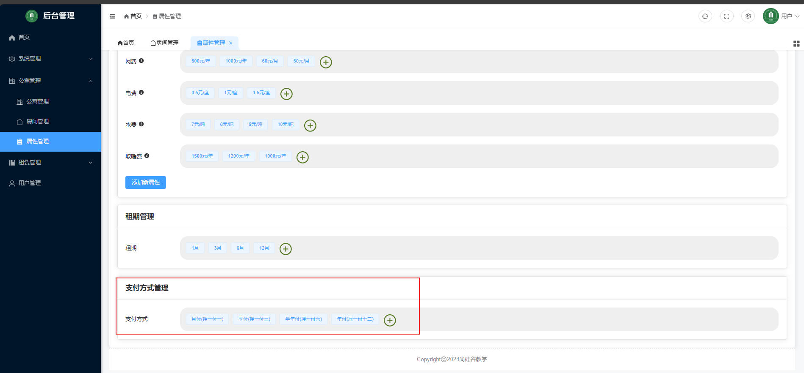

對應的 Controller 為:

具體的實現邏輯看 github 程式碼。

```java
package com.atguigu.lease.web.admin.controller.apartment;
@Tag(name = "支付方式管理")
@RequestMapping("/admin/payment")
@RestController
public class PaymentTypeController {
}
```

#### 1. 配置邏輯刪除

**邏輯刪除功能只對MyBatis-Plus 提供的通用 Service、Mapper 有效，若是手動配置在 Mapper.xml 的 SQL 是不受影響的。**

邏輯刪除的功能如下:

- 將 DELETE SQL 改為 UPDATE SQL。

- 為所有的 SELECT SQL 都自動增加 `is_deleted = 0`的過濾條件。

配置步驟:

##### Step 1 `application.yml`配置

```yml
mybatis-plus:
  global-config:
    db-config:
      logic-delete-field: is_deleted # 全域邏輯刪除的判斷字段名(配置後可忽略 Step.2)，指的是 Table 裡的字段名
      logic-delete-value: 1 # 邏輯已刪除值(default 1)
      logic-not-delete-value: 0 # 邏輯未刪除值(default 0)
```

##### Step 2 指定用來判斷邏輯刪除的字段名

在 `BaseEntity` 中添加`@TableLogic`

```java
    @TableLogic
    private Byte isDeleted;
```

如此一來，由 Mybaits-Plus 自動注入的 SQL 就會實現邏輯刪除功能。

#### 2. 使用`@JsonIngore`忽略某些字段不 return 給前端

若是希望某些字段不要 return 給前端，可以在字段上使用`@JsonIgnore`，這會使得物件在序列化成 JSON 物件時，忽略這些帶有`@JsonIgnore`的字段。

通常情況下，`create_time`、`update_time`、`is_deleted`是不需要 return 給前端的，所以這裡都加上去了。

#### 3. 配置 Mybatis-Plus 自動填充及`is_deleted` default value

當使用以下 API 時，會發現資料庫的`create_time`、`update_time`、`is_deleted`都是null，因此需要為他們配置默認值，而對於`is_deleted`這種字段，只要在 SQL 中為它配置默認值即可:`ALTER TABLE payment_type ALTER COLUMN is_deleted SET DEFAULT 0;`。

```java
    @Operation(summary = "保存或更新支付方式")
    @PostMapping("saveOrUpdate")
    public Result saveOrUpdatePaymentType(@RequestBody PaymentType paymentType) {
        paymentTypeService.saveOrUpdate(paymentType);
        return Result.ok();
    }
```

而對於`create_time`、`update_time`這種變化的字段，則需要使用 Mybatis-Plus 的自動填充功能。

自動填充功能，可以在插入某些字段時，為這些字段賦值。

##### Step. 1 配置自動填充的配置類

```java
package com.atguigu.lease.common.mybatisplus;

import com.baomidou.mybatisplus.core.handlers.MetaObjectHandler;
import org.apache.ibatis.reflection.MetaObject;
import org.springframework.stereotype.Component;

import java.util.Date;

@Component
public class MybatisMetaObjectHandler implements MetaObjectHandler {
    @Override
    public void insertFill(MetaObject metaObject) {
        this.strictInsertFill(metaObject, "createTime", Date.class, new Date());
    }

    @Override
    public void updateFill(MetaObject metaObject) {
        this.strictUpdateFill(metaObject, "updateTime", Date.class, new Date());
    }
}
```

##### Step.2 在 BaseEntity 為需要自動填充的字段配置觸發時機

透過`@TableField()`的`fill`屬性指定要填充的觸發時機

```java
    @Schema(description = "创建时间")
    @TableField(value = "create_time", fill = FieldFill.INSERT)
    private Date createTime;

    @Schema(description = "更新时间")
    @TableField(value = "create_time", fill = FieldFill.UPDATE)
    private Date updateTime;
```

### 2. 房間租期管理

實現的是下圖功能:

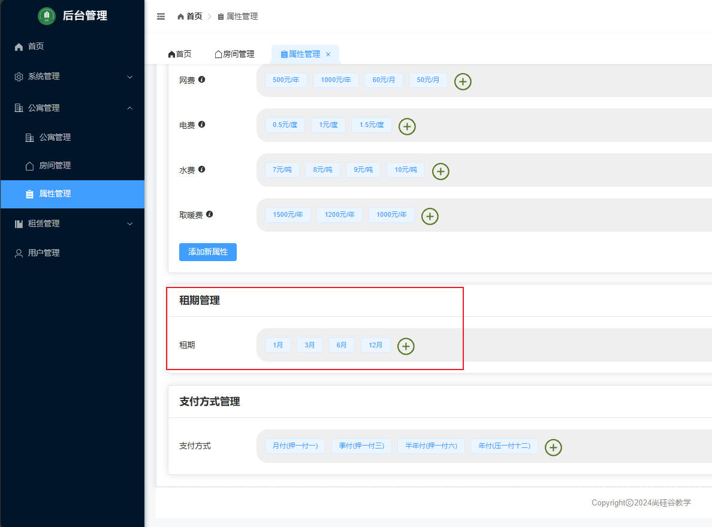

API 有:

- 查詢全部租期列表(`/admin/term/list`)
- 保存或更新租期信息(`/admin/term/saveOrUpdate`)
- 根據 ID 刪除租期(`/admin/term/deleteById`)

這邊的 API 沒什麼需要注意的地方。

### 3. 標籤管理

實現的是下圖功能:

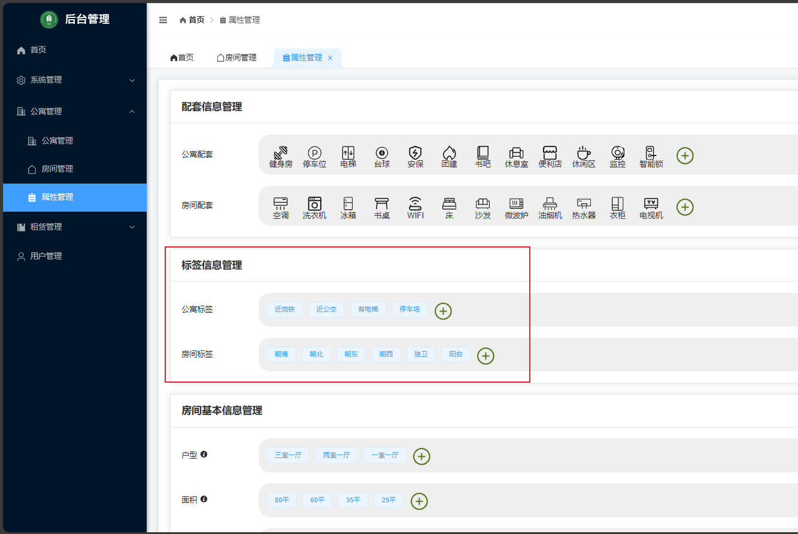

API 有:

- （根據類型）查詢標籤列表(`/admin/label/list`)
- 新增或修改標籤信息(`/admin/label/saveOrUpdate`)
- 根據 ID 刪除標籤訊息(`/admin/label/deleteById`)

#### 1. 調用`/admin/label/list`時的資料類型轉換失敗問題

當調用此 API 時，會報錯，錯誤訊息表示從 `String` Converter To `ItemType`時失敗，為了瞭解此問題的產生及解決方法，因此要先介紹`type`這個 parameter 所涉及的資料類型轉換流程。

```java
    @Operation(summary = "（根據類型）查詢標籤列表")
    @GetMapping("list")
    public Result<List<LabelInfo>> labelList(@RequestParam(required = false) ItemType type) {
        LambdaQueryWrapper<LabelInfo> labelInfoLambdaQueryWrapper = new LambdaQueryWrapper<>();
        labelInfoLambdaQueryWrapper.eq(type !=null, LabelInfo::getType, type.getCode());
        List<LabelInfo> list = labelInfoService.list(labelInfoLambdaQueryWrapper);
        return Result.ok(list);
    }
```

```shell
WARN 3584 --- [nio-8081-exec-3] .w.s.m.s.DefaultHandlerExceptionResolver : Resolved [org.springframework.web.method.annotation.MethodArgumentTypeMismatchException: Failed to convert value of type 'java.lang.String' to required type 'com.atguigu.lease.model.enums.ItemType'; Failed to convert from type [java.lang.String] to type [@org.springframework.web.bind.annotation.RequestParam com.atguigu.lease.model.enums.ItemType] for value '1']
```

#### 2. parameter `type` 的資料類型轉換過程

##### 1. 請求流程(request)

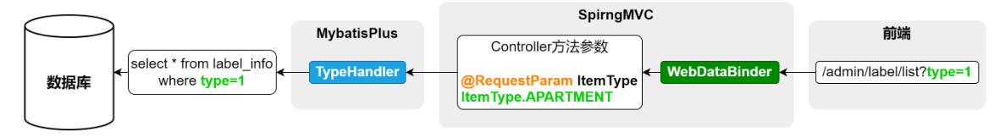

SpringMVC 的 `WebDataBinder` 會將 HTTP Request 的 Request Parameter 綁定到 Controller 方法上的參數，並且進行資料類型的轉換，**注意，不是只綁定到`@RequestParam`的參數上，就算是沒有註解的參數`WebDataBinder`也會嘗試綁定。**

而`TypeHandler`則是處理 JAVA 與資料庫間的資料類型轉換，因此這裡會再將 `ItemType` Converter To INT。

##### 2. 響應流程(response)

同理，資料庫中的資料映射到 JAVA 物件時，資料類型的轉換也是由`TypeHandler`實現的，但須注意資料庫與 JAVA 物件的映射是由`mapper`做的。

而將帶有`@RequestBody`的參數轉換成 JSON 字串則是由`HTTPMessageConverter`實現的。

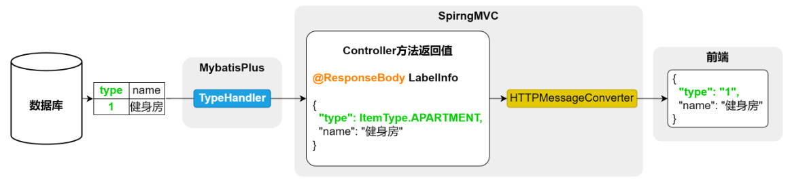

#### `WebDataBinder`是如何實現資料類型轉換的?

`WebDataBinder`在實現數據類型轉換時，實際上是依賴於`Converter`在實現的，spring MVC 提供了各種常用類型的 `Converter`，像是 `String` → `Integer`、`String` → `Date` 等等，而其中也提供了 `String` → `enum` 的轉換，但是提供的是根據`enum`物件名("APARTMENT") → `ItemType.APARTMENT` 這種方式，若想要根據 code 屬性 → `ItemType.APARTMENT` 的話，那需要自定義 `Converter`。

[Converter 官方文檔](https://docs.spring.io/spring-framework/reference/core/validation/convert.html#core-convert-Converter-API)

而具體的實現方式，總共有以下兩種。

方式1:自定義`Converter`:

##### Step. 1 自定義`Converter`

```java
package com.atguigu.lease.web.admin.custom.converter;
@Component
public class StringToItemTypeConverter implements Converter<String, ItemType> {
    @Override
    public ItemType convert(String code) {
        ItemType[] values = ItemType.values();
        for (ItemType itemType : values) {
            if (itemType.getCode().equals(Integer.valueOf(code))) {
                return itemType;
            }
        }
        throw new IllegalArgumentException("code:" + code + "非法");
    }
}
```

##### Step. 2 註冊`Converter`

```java
package com.atguigu.lease.web.admin.custom.config;
@Configuration
public class WebMvcConfiguration implements WebMvcConfigurer {

    @Autowired
    private StringToItemTypeConverter stringToItemTypeConverter;

    @Override
    public void addFormatters(FormatterRegistry registry) {
        registry.addConverter(this.stringToItemTypeConverter);
    }
}
```

方式2:自定義`ConverterFactory`:

先前自定義`Converter`的方式，若是有多個轉換邏輯相同(譬如都是 code → enum)，那就需要為每個 enum 都實作一個 `Coverter`，很不方便，因此這裡介紹另一種實現的方式。

首先，`ConverterFactory`可以將同一套轉換邏輯，應用到一個 `interface` 的所有實現類。

##### Step.1 定義 interface `BaseEnum`

```java
public interface BaseEnum {
    Integer getCode();
    String getName();
}
```

##### Step. 2 `implements ConverterFactory`

轉換的邏輯在這邊寫

```java
@Component
public class StringToBaseEnumConverterFactory implements ConverterFactory<String, BaseEnum> {
    @Override
    public <T extends BaseEnum> Converter<String, T> getConverter(Class<T> targetType) {
        return new Converter<String, T>() {
            @Override
            public T convert(String source) {

                for (T enumConstant : targetType.getEnumConstants()) {
                    if (enumConstant.getCode().equals(Integer.valueOf(source))) {
                        return enumConstant;
                    }
                }
                throw new IllegalArgumentException("非法的枚舉值:" + source);
            }
        };
    }
}
```

#### `TypeHandler`的類型轉換

`TypeHandler`默認也提供了許多類型轉換器，但關於 enum 的類型轉換，默認提供的也是`ItemType.APARTMENT` &lrarr; `"APARTMENT"`，因此若有客製化的需求，在 Mybatis 也需要自定義`TypeHandler`，而在 Mybatis-Plus 中則提供了`@EnumValue`來快速實現。

透過在`IetmType`的`code`添加`@EnumValue`即可

```java
public enum ItemType implements BaseEnum {

    APARTMENT(1, "公寓"),

    ROOM(2, "房间");


    @EnumValue
    @JsonValue
    private Integer code;
    private String name;

    @Override
    public Integer getCode() {
        return this.code;
    }


    @Override
    public String getName() {
        return name;
    }

    ItemType(Integer code, String name) {
        this.code = code;
        this.name = name;
    }

}
```

#### `HTTPMessageConverter`的類型轉換

與之前規則一樣，`HTTPMessageConverter`對於 JAVA 物件與 JSON 字串的轉換，默認也是 Instance &lrarr; Instance name 的方式，而若想客製化類型轉換，也只需要使用`@JsonValue`。

透過在`code`新增`@JsonValue`。

```java
public enum ItemType implements BaseEnum {

    APARTMENT(1, "公寓"),

    ROOM(2, "房间");


    @EnumValue
    @JsonValue
    private Integer code;
    private String name;

    @Override
    public Integer getCode() {
        return this.code;
    }


    @Override
    public String getName() {
        return name;
    }

    ItemType(Integer code, String name) {
        this.code = code;
        this.name = name;
    }

}
```

### 4. 配套管理

實現的是下圖功能:

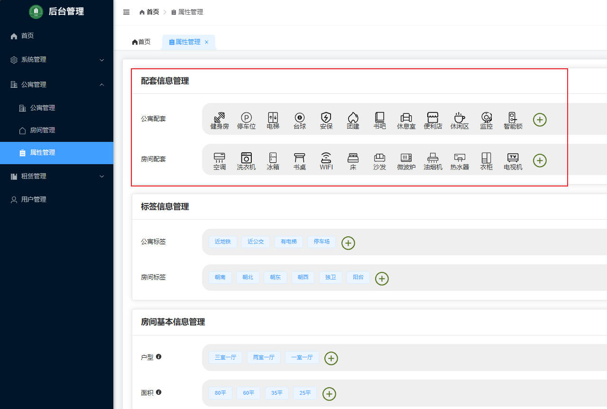

API 有:

- [根據類型]查詢配套信息列表(`/admin/facility/list`)
- 新增或修改配套信息(`/admin/facility/saveOrUpdate`)
- 根據 ID 删除配套信息(`/admin/facility/deleteById`)

這邊的 API 沒什麼需要注意的地方。

### 5. 基本屬性管理

實現的是下圖功能:

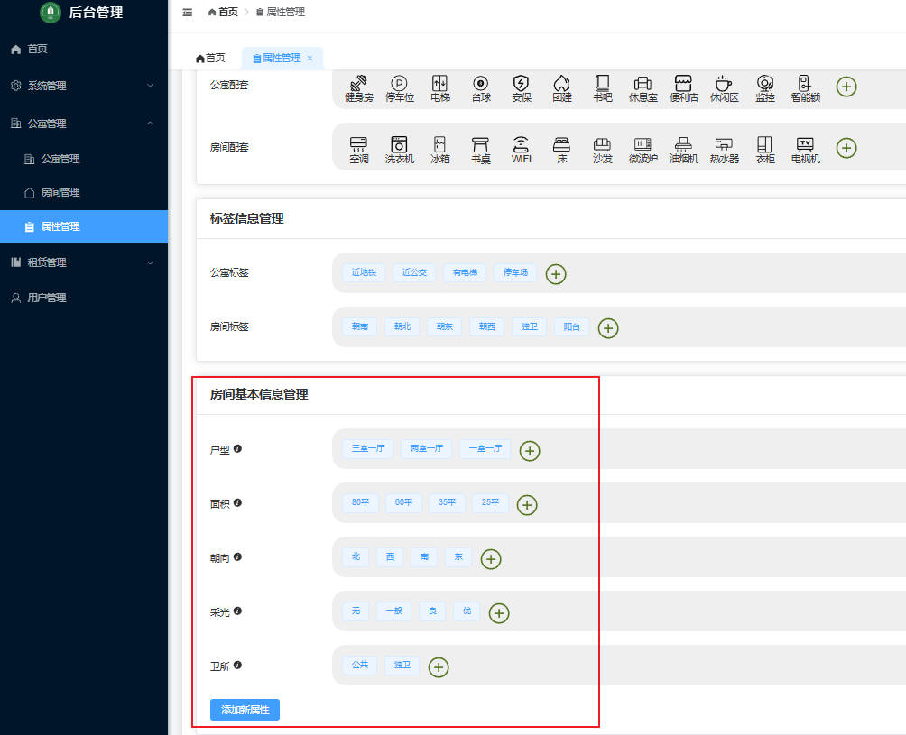

API 有:

- 新增或更新屬性名稱(`/admin/attr/key/saveOrUpdate`)
- 新增或更新屬性值(`/admin/attr/value/saveOrUpdate`)
- 查詢全部屬性及其對應屬性值(`/admin/attr/list`)
- 根據 ID 刪除屬性名稱(`/admin/attr/key/deleteById`)
- 根據 ID 刪除屬性值(`/admin/attr/value/deleteById`)

比較要注意的 API 是「查詢全部屬性及其對應屬性值(`/admin/attr/list`)」

因為屬性及屬性值之間是多對多的關係，因此在 Table 的設計是三張表:

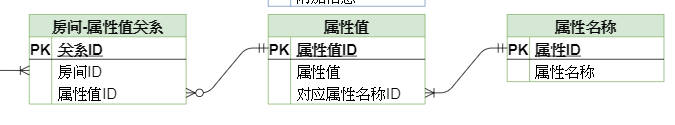

因此若想通過一條 SQL 把屬性及其對應屬性值給查詢出來的話，會需要使用到 JOIN 操作，而 Mybatis-Plus 提供的通用 Mapper、Service 並沒有對於多表查詢支持，因此需要自己寫 SQL。

個人對於 Mybatis-Plus 的使用還是不太熟悉，所以這裡紀錄一下 Mybatis 要怎麼寫自訂的 SQL(**主要是紀錄 mapper.xml 如何編寫**)。

#### mapper.xml

首先這個 Method 要 `return` 的是一個 `List<AttrKeyVo>`

```java
public interface AttrKeyMapper extends BaseMapper<AttrKey> {

    List<AttrKeyVo> listAttrInfo();
}
```

`AttrKeyVo`:

```java
@Data
public class AttrKeyVo extends AttrKey {

    @Schema(description = "属性value列表")
    private List<AttrValue> attrValueList;
}
```

`AttrKey`:

```java
@Schema(description = "房间基本属性表")
@TableName(value = "attr_key")
@Data
public class AttrKey extends BaseEntity {

    private static final long serialVersionUID = 1L;

    @Schema(description = "属性key")
    @TableField(value = "name")
    private String name;

}
```

`AttrValue`:

```java
@Schema(description = "房间基本属性值表")
@TableName(value = "attr_value")
@Data
public class AttrValue extends BaseEntity {

    private static final long serialVersionUID = 1L;

    @Schema(description = "属性value")
    @TableField(value = "name")
    private String name;

    @Schema(description = "对应的属性key_id")
    @TableField(value = "attr_key_id")
    private Long attrKeyId;
}
```

`AttrKeyMapper.xml`:

當查詢結果不是對應到 Entity 而是對應到一個自製的 JAVA Object 時，就需要使用 resultMap 去客製化 SQL result columns 對應到 JAVA Object 的哪些 property。

```xml
<?xml version="1.0" encoding="UTF-8"?>
<!DOCTYPE mapper
        PUBLIC "-//mybatis.org//DTD Mapper 3.0//EN"
        "http://mybatis.org/dtd/mybatis-3-mapper.dtd">
<mapper namespace="com.atguigu.lease.web.admin.mapper.AttrKeyMapper">

    <!-- 將 query result 映射到 JAVA Object 上    -->
    <!-- 標籤裡的 column 指的是 query result 的 column name -->
    <!-- 標籤裡的 property 指的是 JAVA Object 的屬性名 -->
    <resultMap id="AttrKeyVoMap" type="com.atguigu.lease.web.admin.vo.attr.AttrKeyVo">
        <id column="id" property="id"/>
        <result column="name" property="name"/>
        <collection property="attrValueList" ofType="com.atguigu.lease.model.entity.AttrValue">
            <id property="id" column="attr_value_id"/>
            <result property="name" column="attr_value_name"/>
            <result property="attrKeyId" column="attr_key_id"/>
        </collection>
    </resultMap>

    <select id="listAttrInfo" resultMap="AttrKeyVoMap">
        SELECT ak.id          AS id,
               ak.name        AS name,
               av.id          AS attr_value_id,
               av.name        AS attr_value_name,
               av.attr_key_id AS attr_key_id,
               ak.is_deleted
        FROM attr_key AS ak
                 LEFT JOIN attr_value AS av
                           ON av.is_deleted = 0
                               AND av.attr_key_id = ak.id
        WHERE ak.is_deleted = 0
    </select>
</mapper>
```

### 6. 房間雜費管理

實現的是下圖功能:

可以看出「雜費名稱」與「雜費值」也會是多對多的關係，所以 Table 也是 3 張。

在實作「查詢全部雜費名稱和雜費值列表(`/admin/fee/list`)」時也需要自己在`mapper.xml`寫 SQL，因為「基本屬性管理」那有記錄過了，這邊不再紀錄。

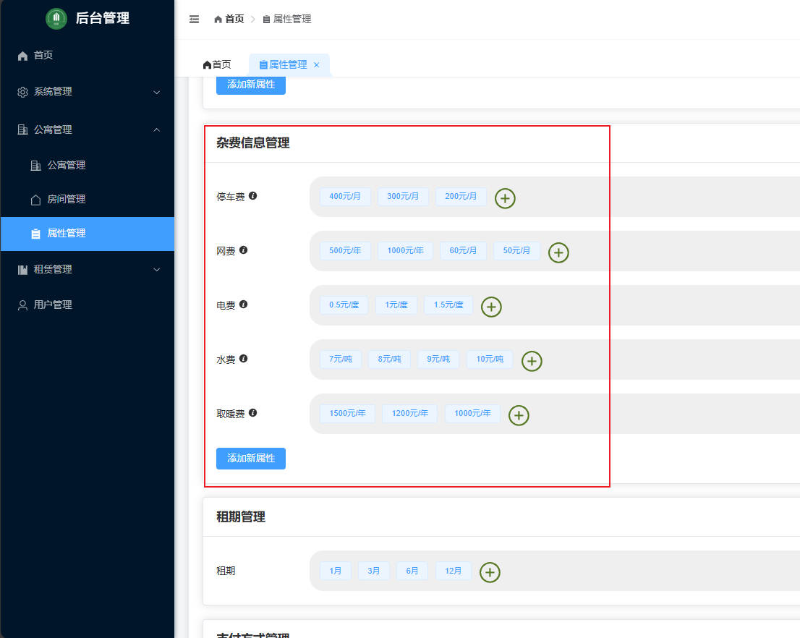

API 有:

- 保存或更新雜費名稱(`/admin/fee/key/saveOrUpdate`)
- 保存或更新雜費值(`/admin/fee/value/saveOrUpdate`)
- 查詢全部雜費名稱和雜費值列表(`/admin/fee/list`)
- 根據 ID 刪除雜費名稱(`/admin/fee/key/deleteById`)
- 根據 ID 刪除雜費值(`/admin/fee/value/deleteById`)

### 7. 地區信息管理

這裡實現的是查詢省份、城市、區縣的 API，並不提供新增之類的操作，那是在建表時直接透過 SQL 完成的。

API 有:

- 查詢省份信息列表(`/admin/region/province/list`)
- 根據省份 ID 查詢城市相關列表(`/admin/region/"city/listByProvinceId`)
- 根據城市 ID 查詢區縣相關列表(`/admin/region/district/listByCityId`)

看起來沒什麼要記錄的。

### 8. 圖片上傳管理

這邊主要介紹如何設定 minio 讓圖片儲存在 minio 裡，**但還沒將 minio return 的 url 放到資料庫。**

就只有一個上傳圖片的 API:

MultipartFile 是 springMVC 提供一個用於接收上傳檔案的 Obj。

這個 API 會將接收到的圖片儲存到 minio 後，return 圖片儲存的 url 給前端。

```java
@Tag(name = "文件管理")
@RequestMapping("/admin/file")
@RestController
public class FileUploadController {

    @Operation(summary = "上傳文件")
    @PostMapping("upload")
    public Result<String> upload(@RequestParam MultipartFile file) {
        return Result.ok();
    }

}
```

#### 1. minio 配置

1. 在 common module 導入 maven dependency

```xml
<dependency>
    <groupId>io.minio</groupId>
    <artifactId>minio</artifactId>
</dependency>
```

2. 配置  minio 相關參數於`application.yml`

```yml
minio:
  endpoint: http://<hostname>:<port>
  access-key: <access-key>
  secret-key: <secret-key>
  bucket-name: <bucket-name>
```

3. 配置 `MinioProperties`

```java
@Data
@ConfigurationProperties(prefix = "minio")
public class MinioProperties {
    private String endpoint;
    private String accessKey;
    private String secretKey;
    private String bucket;
}
```

4. 配置`MinioClient`且交由 spring 管理

```java
@Configuration
@EnableConfigurationProperties(MinioProperties.class)
public class MinioConfiguration {

    @Autowired
    private MinioProperties minioProperties;

    @Bean
    public MinioClient minioClient() {
        return MinioClient.builder().endpoint(minioProperties.getEndpoint())
                .credentials(minioProperties.getAccessKey(), minioProperties.getSecretKey())
                .build();
    }
}
```

#### 2. 調用 `minioClient`

當配置完 minio 後，即可調用`minioClient`。

因為往 minio 存圖片的 code 滿制式化的，故只記錄程式碼，不做說明。

FileUploadController:

```java
@Tag(name = "文件管理")
@RequestMapping("/admin/file")
@RestController
public class FileUploadController {

    @Autowired
    private FileService fileService;

    @Operation(summary = "上傳文件")
    @PostMapping("upload")
    public Result<String> upload(@RequestParam MultipartFile file) throws ServerException, InsufficientDataException, ErrorResponseException, IOException, NoSuchAlgorithmException, InvalidKeyException, InvalidResponseException, XmlParserException, InternalException {
        String url = fileService.upload(file);
        return Result.ok();
    }

}
```

FileServiceImpl:

```java
@Service
public class FileServiceImpl implements FileService {

    @Autowired
    private MinioClient minioClient;
    @Autowired
    private MinioProperties minioProperties;

    @Override
    public String upload(MultipartFile file) throws ServerException, InsufficientDataException, ErrorResponseException, IOException, NoSuchAlgorithmException, InvalidKeyException, InvalidResponseException, XmlParserException, InternalException {
        boolean bucketExists = minioClient.bucketExists(BucketExistsArgs.builder().bucket(minioProperties.getBucketName()).build());
        if (!bucketExists) {
            minioClient.makeBucket(MakeBucketArgs.builder().bucket(minioProperties.getBucketName()).build());
            minioClient.setBucketPolicy(SetBucketPolicyArgs.builder().bucket(minioProperties.getBucketName())
                    .config(createBucketPolicyConfig(minioProperties.getBucketName()))
                    .build());
        }
        String filename = new SimpleDateFormat("yyyyMMdd").format(new Date()) + "/" + UUID.randomUUID() + "-" + file.getOriginalFilename();
        minioClient.putObject(PutObjectArgs.builder().bucket(minioProperties.getBucketName())
                .stream(file.getInputStream(), file.getSize(), -1).object(filename).contentType(file.getContentType()).build());

        String url = String.join("/", minioProperties.getEndpoint(), minioProperties.getBucketName(), filename);
        return url;

    }

    private String createBucketPolicyConfig(String bucketName) {

        return """
                {
                  "Statement" : [ {
                    "Action" : "s3:GetObject",
                    "Effect" : "Allow",
                    "Principal" : "*",
                    "Resource" : "arn:aws:s3:::%s/*"
                  } ],
                  "Version" : "2012-10-17"
                }
                """.formatted(bucketName);
    }
}
```

教學在這裡對 Exception 的處理只是使用`@ControllerAdvice`去 `return Result.fail();`

```java
package com.atguigu.lease.common.exception;

import com.atguigu.lease.common.result.Result;
import org.springframework.web.bind.annotation.ControllerAdvice;
import org.springframework.web.bind.annotation.ExceptionHandler;
import org.springframework.web.bind.annotation.ResponseBody;

/**
 * ClassName: GlobalExceptionHandler
 * Package: com.atguigu.lease.common.exception
 */
@ControllerAdvice
public class GlobalExceptionHandler {

    @ExceptionHandler(Exception.class)
    @ResponseBody
    public Result handle(Exception e) {
        e.printStackTrace();
        return Result.fail();
    }
}

```

### 9. 公寓管理

實現的是下圖功能:

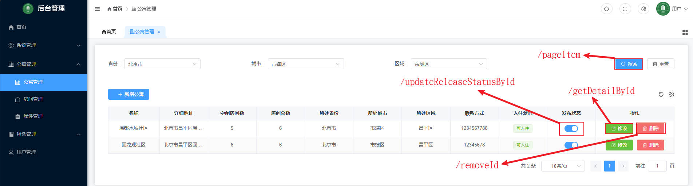

API 有:

- 保存或更新公寓訊息(`/admin/apartment/saveOrUpdate`)
- 根據條件分頁查詢公寓列表(`/admin/apartment/pageItem`)
- 根據 ID 獲取公寓詳細訊息(`/admin/apartment/getDetailById`)
- 根據 ID 刪除公寓訊息(`/admin/apartment/removeById`)
- 根據 ID 修改公寓發布狀態(`/admin/apartment/updateReleaseStatusById`)
- 根據區縣 ID 查詢公寓信息列表(`/admin/apartment/listInfoByDistrictId`)

#### 保存或更新公寓訊息(`/admin/apartment/saveOrUpdate`)

這個 API 是在「新增公寓」、「修改」時的頁面點擊保存時觸發的

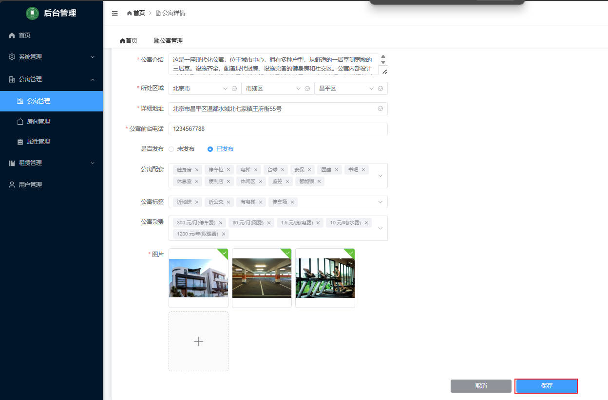

先複習一下公寓Table 與雜費、標籤等等Table的關係:

能看到公寓Table 與雜費、標籤等是以中間表的方式關聯者。

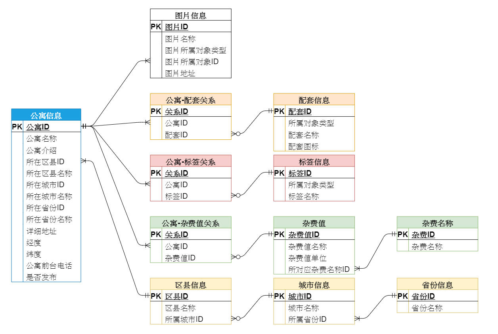

另外，教學中是把公寓所屬的雜費、標籤、配套、圖片等訊息都刪除，再更新一筆新的進去，
而非在前端編寫邏輯判斷新插入的數據為哪些。

#### 根據條件分頁查詢公寓列表(`/admin/apartment/pageItem`)

這個 API 涉及到分頁插件的使用，以及在`mapper.xml`自訂 SQL 時使用到 Mybatis 的`<where>`、`<if>`標籤及 SQL 語句稍微複雜一點，直接去看 Code 複習快點。

#### 根據 ID 獲取公寓詳細訊息(`/admin/apartment/getDetailById`)

每個 sql 都是自訂的，除此外沒特別的點，可以去程式看一下 sql 的邏輯。

#### 根據 ID 刪除公寓訊息(`/admin/apartment/removeById`)