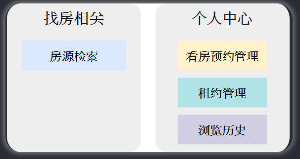
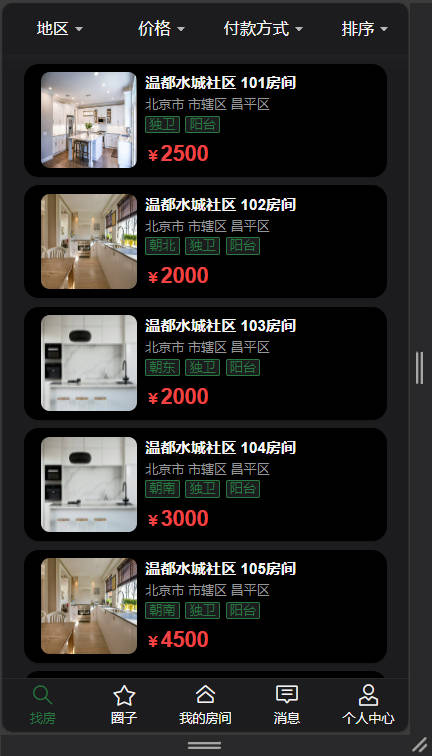
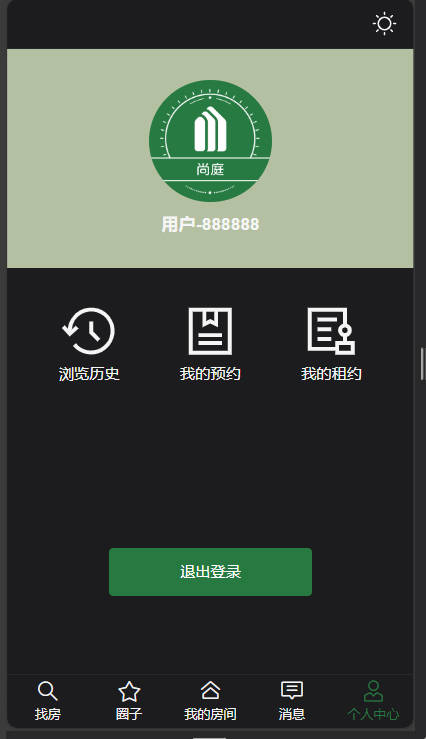
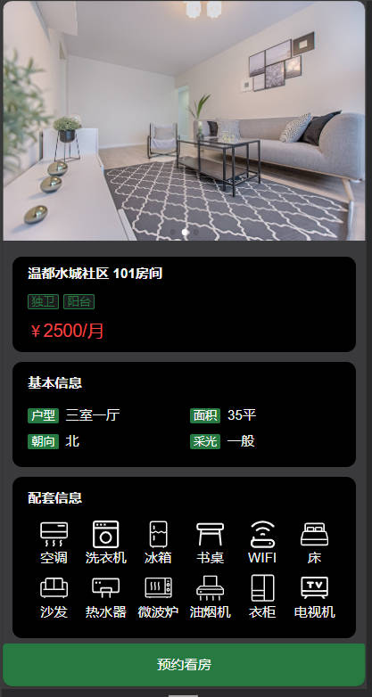
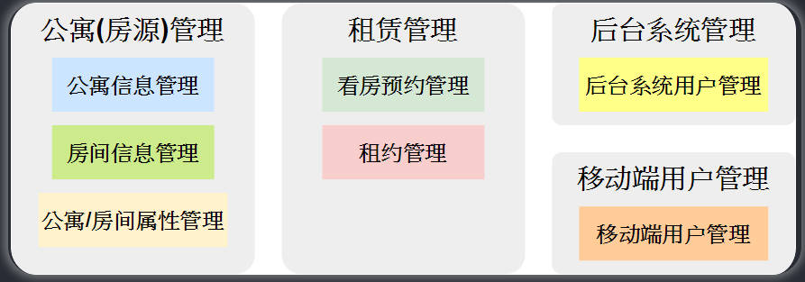

# JAVA 尚廷公寓

## 學習目的

此次為第二次學習此項目，第一次學習時並沒有太了解項目的業務邏輯，以及資料表的結構，使得在實作 api 時，儘管只是簡單的 CRUD，但有些部分會因為對資料表的不熟悉，而聽得不是很明白，所以此次會詳細理解資料表的結構是如何設計的。

### 主要學習點

1. 了解一般前後端項目開發流程
2. 了解資料庫的具體設計步驟
3. 複習 MyBatis-Plus 使用方式
4. 了解 redis 的具體應用場景
5. 了解 nginx 的部屬流程

## 項目概述

此項目為一個公寓租賃平台，又分為移動端(app)、後台管理端。

### 移動端

尚硅谷提供的移動端項目URL:`http://139.198.127.41:8002`

移動端就是一般用戶使用的介面，這裡設計成 mobile 的介面。

#### 主要業務功能

##### 房源檢索

根據搜尋條件去查詢房間

##### 租約管理、瀏覽歷史

就是對應圖中的幾個功能。

而預約看房的功能，是放在房間頁面的，當點進去某間房間時，就會出現預約看房的按鈕。

### 後臺管理

#### 主要業務功能

尚硅谷提供的後台URL:`http://139.198.127.41:8001`

這裡功能比較多，但都不複雜，直接操作也能理解，比較需要注意的是屬性滿多的，要理解每個屬性的業務邏輯，以及「租賃管理」是少數真正涉及到使用者的功能。

**另外，這個項目的用戶似乎沒有房東、房客等身分別，租約是直接由後臺管理員建立給租客(用戶)的，而不是透過房東建立給租客這種形式。**

- 公寓資訊管理

 這個模組負責管理所有公寓的基本訊息，包括公寓名稱、地址、聯絡資訊等。管理員可以在這裡新增、編輯、刪除公寓資訊。

- 房間資訊管理

 本模組負責管理每個公寓內各個房間的詳細信息，包括房間號碼、戶型、面積、租金等。管理員可以在這裡進行房間資訊的新增、編輯和刪除。

- 公寓/房間屬性管理

 這個模組允許管理員定義公寓和房間的各種屬性，例如公寓和房間的配套設施，方便管理員在維護公寓資訊和房間資訊時進行選擇。

- 看房預約管理

 此模組用於管理使用者的看房預約請求。使用者可以在行動端提交看房預約，管理員可以在後台管理系統中查看和處理這些請求，以方便安排人員接待使用者。

- 租約管理

 這個模組用於管理租約的建立、修改和終止。管理員可以在這裡產生租約合同，並發送給用戶簽約。

- 後台系統使用者管理

 此模組用於管理後台系統的使用者帳戶訊息，管理員可以建立、編輯、刪除、停用帳戶資訊。

- 行動端用戶管理

 這個模組負責管理行動端用戶的資訊。管理員可以查看使用者訊息，處理帳戶相關問題。

### 核心業務邏輯流程

可以看到租約是由後臺管理員直接建立的，而非由房東對房客。

